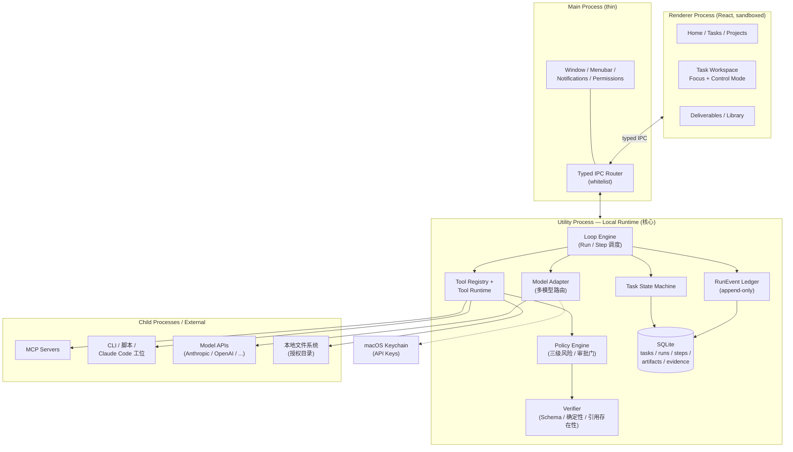
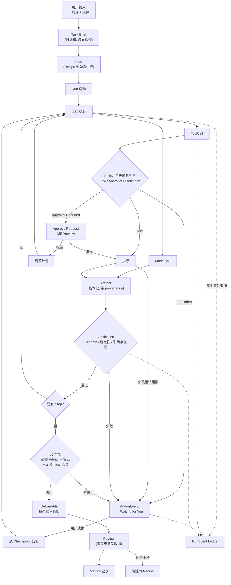

# LeanClaw — Stage 1：产品形态与架构方向

> 版本：v0.2 ｜ 日期：2026-07-10 ｜ 状态：已确认（六处过度工程风险已裁决，见第 14 节）
> 本文档回答"LeanClaw 是什么、长什么样、怎么运转、MVP 做多少"，不含实施细节。实施方案（数据模型、代码骨架、开发计划）在 Stage 2 确认后输出。

---

## 1. 一句话项目定义

LeanClaw 是一款 Mac 桌面 AI 工作伙伴：用户用一句自然语言交代完整任务，它自动读取资料、规划步骤、调用模型与工具，把可直接验收的成果交付出来——而底层由一套 TPS 式的精益执行控制层保证整个过程可停线、可验证、可恢复、可复盘。

一个更短的说法：**表面是一个可靠的 AI 同事，底层是一条受控的生产线。**

## 2. 与 WorkBuddy、OpenClaw、Claude Code 的关系

这三个参照系各自只贡献一件事，且都不是被复制的对象：

| 参照系 | 贡献什么 | 明确不取什么 |
|---|---|---|
| WorkBuddy | 前台产品形态：一句话发起、自动规划、进度可见、成果直达 | 品牌、视觉、界面细节、专有实现 |
| OpenClaw | 本地能力生态思路：本地优先、常驻、模型可配、Skill/MCP 扩展 | 其 Gateway 架构、UI、代码 |
| TPS | 底层执行哲学：停线、验证门、防错、标准作业、改善 | 管理学术语上界面、制造业看板隐喻 |
| Claude Code / Codex | 一类专业执行工位（Code Capability） | 成为信息架构中心、开发者控制台形态 |

关键判断：这四者的关系不是并列拼装，而是**分层**。WorkBuddy 决定用户看到什么，TPS 决定运行时怎么运转，OpenClaw 决定能力从哪里来，Claude Code 只是被接入的一个工位。任何一层越界——比如 TPS 术语冒到首页、Code 工位变成产品主界面——都算设计失败。

## 3. 目标用户、核心场景与差异化

### 目标用户

第一阶段只有一个用户：应用所有者本人。这个约束是设计资产而不是遗憾——它意味着 MVP 不需要 onboarding 流程、多用户权限、租户隔离，也不需要向陌生用户解释概念。所有"这个功能普通用户看得懂吗"的问题，答案都以"重度 AI 使用者、Agent 工作流设计者"为准。

### 核心场景（按频率与价值排序）

1. **深度研究**：给一个主题（可附文件），产出带引用、引用可核验的分析报告；
2. **内容生产**：给素材和平台要求，产出小红书文章、长文、营销方案；
3. **文件/代码修改**：给一个目录，读取、改动、Diff 预览、批准后写入、验证；
4. 投研分析、PDF/表格批处理、长周期项目推进（MVP 后逐步覆盖）。

### 差异化：一句话版本

市面上已有的东西都缺一半：聊天工具能对话但不能交付；自治 Agent 能干活但不可控；工作流工具可控但要手工搭流程。LeanClaw 的位置是——**自然语言交代任务的轻松程度 × 生产线级别的执行可控性**，两个都要，且默认状态下用户只感知前者。

具体差异体现在六个可验证的产品行为上：

- 任务失败时**不会静默糊弄**——Andon 停线，告诉你哪一步、为什么、已完成部分是否还有效；
- 报告里的结论**能点回原始来源**——网页、PDF 页码、文件片段；
- 高风险写入**必过 Diff + 批准**；
- 应用重启后**任务能从检查点恢复**，不是从头再来；
- 成功的任务**能沉淀为 Recipe** 下次一键复用；
- "完成"由 Runtime 和验证规则判定，**不由模型自述判定**。

## 4. 完整用户旅程：从一句话到成果交付

以最高频的深度研究任务为例，走一遍完整旅程。旅程分七幕，用户在每一幕看到的东西都刻意保持在"同事汇报工作"的颗粒度。

**第一幕：交代任务。** 用户按全局快捷键或点 Dock 图标呼出 LeanClaw，首页正中是一个大输入框。输入"研究最近三个月 AI Agent 桌面应用的发展，输出一份带引用的分析报告"，顺手拖入两个参考 PDF。输入框下方有三个轻量选项（输出形式、是否联网、预算上限），全部有合理默认值，不改也能直接按 ⌘↩ 发起。

**第二幕：确认 Brief。** 系统在几秒内生成一份可编辑的 Task Brief：目标复述、范围边界、交付物定义（Markdown 报告 + 引用清单）、预计用到的能力（联网检索、文件读取）、预算与时限。如果目标存在关键歧义（比如"桌面应用"是否包含浏览器插件），Brief 上会标出一个待确认问题——这是第一道 Jidoka 门，但它只在真有歧义时出现，不是每次都拦。用户改两个字或直接点"开始"。

**第三幕：看着它干活。** 任务进入 Running，界面显示的是同事式的进度："已读取 2 个 PDF → 正在检索 2026 年 4 月以来的产品动态 → 已保存 14 个来源 → 正在形成报告结构……"每条进度背后是真实的 Step 与 ToolCall，但默认不展开。用户可以切走干别的事，任务在后台跑，菜单栏图标显示运行状态。

**第四幕：需要你一下。** 某个来源抓取连续失败，或报告初稿里一个关键数据无法从任何来源验证——系统触发 Andon，任务转入 Waiting for You，发一条系统通知。用户点开看到一张卡片：发生了什么、影响哪一节、已完成的部分仍然有效、推荐动作（跳过该来源 / 换关键词重试 / 手动补充资料）。选一个，任务从检查点继续，不重跑已完成的步骤。

**第五幕：验证与交付。** 报告生成后自动进入 Verifying：引用是否真实存在于已保存的来源中、格式是否符合交付契约。全部通过，任务变为 Delivered，通知送达。

**第六幕：验收成果。** 用户打开任务页,最上方就是最终交付物：应用内预览渲染好的报告，每个关键结论旁有引用角标，点击直接跳到来源原文和抓取快照。可以导出、在 Finder 中打开、或在下方输入框里说"第三节太浅，展开竞品对比"——这条指令成为一次增量 Run，只重跑受影响的步骤。

**第七幕：沉淀。** 任务归档时系统记录了事实级复盘数据：成本、耗时、哪一步返工过、人工介入了几次、哪些来源最终被采用。如果用户觉得这个流程好用，一键"存为 Recipe"，下次同类任务直接套用。

整个旅程中用户做了四件事：说目标、确认 Brief、处理一次 Andon、验收成果。其余全部由系统完成。这就是产品要达到的体验基线。

## 5. Focus Mode 与 Control Mode 的关系

两个模式不是两个界面，而是**同一个任务空间的两种展开深度**。类比 macOS 的 Finder：默认是简洁的图标视图，⌘I 才看到完整元数据——没人会说 Finder 是两个产品。

| | Focus Mode（默认） | Control Mode（展开） |
|---|---|---|
| 回答的问题 | 干到哪了？有什么成果？需要我吗？ | 为什么慢/错/贵？从哪恢复？怎么改进？ |
| 呈现内容 | 进度摘要、决策卡片、成果预览 | 状态机、Step、ToolCall、Evidence、检查点 |
| 进入方式 | 打开任务即是 | 任务页内点"查看完整执行过程" |
| 使用频率预期 | 每个任务 | 少数复杂/异常任务 |

三条设计规则保证两者不割裂：

1. **同一数据，不同投影**。Focus Mode 的每条进度摘要都是 Control Mode 中某个 Step 的投影，点击摘要即定位到对应 Step——不存在两套状态。
2. **异常自动升维**。Andon 触发时，Focus Mode 的卡片直接携带指向 Control Mode 相应位置的入口，用户不需要自己去翻日志。
3. **Control Mode 永远不是入口**。任务创建、日常查看都发生在 Focus Mode；Control Mode 没有独立的一级导航，只从任务内进入（Advanced 区的 Run Inspector 是它的跨任务索引）。

## 6. 一级信息架构

采用提示词建议的七项导航，逐项确认后做了两处收敛判断：

```
侧边栏（自上而下）
├── Home            首页：输入框 + 需要你处理 + 进行中 + 最近交付
├── Tasks           任务中心：All / Running / Need You / Delivered / Blocked / Scheduled / Archived
├── Projects        长周期上下文容器
├── Deliverables    交付物库
├── Library         Recipes / Skills / Sources / Context Packs / Saved Instructions
├── ─────────
├── Advanced        折叠区：Run Inspector（统一运行检查器，含 Run 链路、事件日志、工具调用）
└── Settings        模型与 API / 权限 / 预算 / 隐私 / 外观
```

两处收敛判断：

- **Tasks 默认列表视图，看板视图 MVP 不做**。单用户场景下看板的信息密度收益很低，而"Need You"筛选器 + 系统通知已经覆盖了看板最有价值的"什么在等我"功能。
- **Projects 在 MVP 中是轻量容器**（名称 + 关联文件 + 任务分组 + 稳定指令），不做持续上下文的自动管理。理由见第 14 节。

## 7. 三个核心页面的详细结构

以下描述以标准 Mac 桌面应用词汇给出，目标是读完能画出界面。

### 7.1 Home

窗口结构：左侧标准 macOS 侧边栏（可 ⌘⌥S 折叠），右侧为 Home 内容区。无顶部大 banner，无欢迎语。

内容区自上而下四段：

1. **任务输入卡**（视觉主体，占首屏约 40% 高度）。一个大号多行文本框，placeholder 轮换展示真实任务示例。文本框本身是拖放目标——拖入文件/文件夹/图片/PDF 后在框内下沿显示为附件 chip。框下沿一行轻量控件：输出形式下拉（自动/报告/文章/表格/代码……）、权限三开关（联网/写文件/执行命令，默认开/关/关）、预算输入、Recipe 选择器。右下角主按钮"开始任务"（⌘↩）。所有控件都有默认值，最短路径就是打字+回车。
2. **需要你处理**（有事才出现）。横向排列的 Andon/Approval 卡片，每张卡片：任务名、发生了什么、推荐动作按钮（直接在卡片上操作，不必进任务页）。这一段有内容时会排在输入卡之上——等待用户的事项优先级高于发起新任务。
3. **进行中**。每个运行中任务一行：任务名、当前进度短语（"正在核验引用 · 12/14"）、微型进度指示、耗时。点击进入任务页。
4. **最近交付**。最近 6 个 Deliverable 的缩略卡（文件类型图标 + 标题 + 所属任务 + 时间），点击进入预览。

菜单栏（NSStatusItem）常驻一个轻量入口：显示运行中任务数，点开是迷你面板——快速输入框 + 进行中列表 + 需要你处理，全局快捷键（默认 ⌥Space，可改）呼出同一面板。

### 7.2 Task Workspace（任务详情页）

产品最重要的页面。三栏结构，左右两栏可折叠，默认状态取决于任务阶段。

**左栏：上下文（默认折叠，260pt）。** 所属 Project、同项目其他任务、本任务的输入文件列表（可预览）、用户补充过的信息。它回答"这个任务的原料是什么"。

**中栏：主工作区（自适应，最小 560pt）。** 自上而下：

1. **标题栏**：任务名（可改）、状态胶囊（颜色语义：蓝=Running、橙=Waiting for You、紫=Verifying、绿=Delivered、红=Blocked）、运行时长、控制按钮组 [Pause/Resume] [Stop] [Adjust Plan] [⋯（Retry / Restore from Checkpoint / Archive）]。
2. **Task Brief 区**（可折叠）：目标、范围、交付契约。Delivered 前可编辑，编辑触发计划重估。
3. **计划与进度区**：垂直步骤列表，每步一行——状态图标（✓ 完成 / ● 进行中带 spinner / ○ 待执行 / ⚠ 异常）+ 步骤名 + 一句话产出摘要（"已保存 14 个来源"）。进行中的步骤下方流式显示当前动作短语。**这里就是 Focus/Control 的切换点**：每一步可单独展开，显示该步的模型调用、ToolCall、输入输出摘要、耗时与成本；区块右上角"查看完整执行过程"进入 Run Inspector。
4. **成果区**：关键中间 Artifact（大纲、来源清单）以卡片呈现；最终 Deliverable 以大预览卡呈现——应用内渲染 + [导出] [在 Finder 中显示] [版本] [来源追溯]。
5. **底部输入框**：追问、补充、修改指令的入口。它是对任务的操作（生成增量 Run），不是开新聊天。

**右栏 Inspector（280pt，随上下文切换）。** 顶部分段控件：Artifacts / Evidence / Approvals / Verification / Cost。默认自动选中与当前阶段最相关的一页——执行中显示 Cost 与实时 ToolCall 摘要，Andon 时跳到 Approvals，交付后跳到 Verification 结果。Evidence 页是引用核验的主界面：来源列表，每条含域名/文件名、抓取时间、支持的结论、验证状态徽章。

**Run Inspector**（从中栏进入，占据中栏或独立 sheet；Advanced 区提供其跨任务索引）：Task → Run → Step → Artifact → Verification 主链路的图形视图，标出并行 Worker、Andon 位置、检查点，并内嵌事件日志与工具调用明细。每个 Step 节点可 [从此处重跑]。这是检查工具，不是创建入口。**它是 MVP 阶段 Advanced 区唯一的页面**——Tool Registry、MCP Center、Metrics、Andon Center 等独立页面在某类数据达到独立使用频率、无法在 Inspector 中高效处理之前不拆分。

### 7.3 Deliverables

结构上最简单的页面，但承载"成果优先"的价值观。

- 顶部工具栏：搜索框 + 筛选器（项目 / 任务 / 类型 / 时间）+ 视图切换（网格/列表，默认网格）。
- 网格视图：每个交付物一张卡——类型缩略图（文档显示首段渲染、图片显示缩略、代码显示文件树摘要）、标题、所属任务、交付时间、验证状态徽章（✓ 已验证 / ⚠ 部分验证 / — 未验证）。
- 点击进入预览面板（右侧滑出或独立窗口）：完整渲染 + [导出] [Finder 中显示] [回到任务] [查看来源] [基于此继续]——最后一个按钮把该 Deliverable 作为输入发起新任务，是复用链路的入口。

## 8. 用户可见状态与内部状态的映射

用户可见状态固定九个，内部状态可以细分演化，但**每个内部状态必须映射且仅映射到一个用户可见状态**。

| 用户可见状态 | 含义（用户视角） | 对应内部状态 |
|---|---|---|
| Draft | 还没开始，可以改 | draft |
| Planning | 正在理解和规划 | planning |
| Running | 正在干活 | queued, step_running, step_retrying, paused_by_user |
| Waiting for You | 需要你做个决定 | awaiting_approval, andon_open |
| Verifying | 正在核验成果 | verifying |
| Delivered | 已交付，可验收 | delivered |
| Blocked | 卡住了，无法自行继续 | verification_failed, failed |
| Cancelled | 你取消了 | cancelled_by_user |
| Archived | 已归档 | archived |

三条硬规则：

1. **状态转换只由 Runtime 状态机执行**。模型输出"任务已完成"只是文本；进入 Delivered 的唯一路径是：必需 Step 完成 ∧ 必需 Artifact 存在 ∧ 必需 Verification 通过 ∧ 无未处理 Critical 风险 ∧ 成果已持久化 ∧ 恢复信息已保存。
2. **Paused 不是独立的用户可见状态**——用户主动暂停的任务显示为 Running 状态下的"已暂停"角标（内部 paused_by_user）。理由：暂停是用户自己做的动作，不需要一个状态来提醒他；九个状态里每一个都应对应"系统想告诉用户的一件事"。
3. **Blocked 与 Waiting for You 的边界**：只要系统能给出可选的恢复动作，就是 Waiting for You；只有恢复需要用户做界面之外的事（充值 API、修复网络、放弃任务）才是 Blocked。这个边界决定了用户对两种橙色/红色的心理预期。

## 9. TPS 思想如何下沉为产品机制

原则：TPS 的每个概念都必须回答"它在运行时是哪段代码的行为、在界面上是哪个可点的东西"。回答不出来的，不进 MVP。

| TPS 概念 | 运行时机制 | 界面呈现 | MVP 范围 |
|---|---|---|---|
| Jidoka 停线 | Step 执行器上的守卫：Schema 不符 / ToolCall 连败 / 预算触顶 / 高风险动作 / 注入检测 → 状态机转 awaiting_* 或 andon_open，禁止静默续跑 | 任务状态变橙 + 系统通知 | ✅ 全量 |
| Andon 显性化 | AndonEvent 实体：原因、影响范围、已完成部分有效性、推荐动作列表、恢复检查点 | "需要你处理"卡片（Home + 任务页 + 菜单栏） | ✅ 全量 |
| Poka-Yoke 防错 | 三级风险判定：Low / Approval Required / Forbidden，由工具类型 + 关键参数规则决定（如：写入白名单外路径 = Forbidden），不计算风险分数、不建策略 DSL | Approval 卡片内嵌 Diff 视图 + [批准] [拒绝] | ✅ 三级规则 |
| 验证门 | 三级验证：Schema → 确定性 → 引用存在性；模型评审、复杂规则、人工评审不建通用框架，等三条 Recipe 出现明确重复需求后按场景增加 | Verifying 状态 + 成果上的验证徽章 + Inspector 的 Verification 页 | ✅ 三级 |
| Genchi Genbutsu | Evidence 实体四字段：sourceType、locator（URL+选区 / PDF+页码 / 文件+行号）、excerpt、verificationStatus，经外键关联结论 Artifact；不设"不确定性"字段 | 报告内引用角标 → 点击回到原文/快照 | ✅ 四字段 |
| Standard Work | Recipe（面向用户）↔ LoopTemplate（底层契约：步骤、工具白名单、验证、预算、停止规则） | Library 里的 Recipe 卡片 + 任务输入框的 Recipe 选择器 | ✅ 3 条内置，用户自建推迟 |
| Kanban / WIP | 调度器常量：活跃任务上限（默认 3）、高成本模型并发上限、高风险工具串行化 | 超限时输入框下方一行提示"将排队执行" | ✅ 简化版（常量，非策略引擎） |
| JIT 按需激活 | 默认单执行者；联网/证据验证/高成本模型/大 Context Pack 均按 Step 声明按需启用 | 无（用户无感，体现在成本上） | ✅ 作为默认行为 |
| Muda 浪费记录 | RunEvent 账本记录重复调用、无效重试、被弃 Artifact、人工介入等**原始事实** | 任务复盘摘要（成本/耗时/返工/介入次数） | ✅ 只记录，不算综合分 |
| Kaizen 改善 | 复盘数据 → 用户手动决定是否更新 Recipe；Eval Cases 对比新旧版本 | 任务归档时的"存为 Recipe"按钮 | ⚠️ 手动沉淀进 MVP，Eval 对比推迟 |

这张表同时是 MVP 的 TPS 边界声明：**停线、显性化、防错、三级验证、证据回溯全量做；标准作业做内置三条；WIP 做常量；浪费只记账；改善只留手动入口。** 综合 TPS 评分明确不做——数据不足时的综合分数是装饰性指标。

## 10. 技术路线对比与推荐

| 维度 | SwiftUI 原生 | Tauri + React | **Electron + React** | Web App + menubar |
|---|---|---|---|---|
| MVP 开发速度 | 慢（AI 生态需自建） | 中 | **快** | 快但体验残缺 |
| Mac 桌面体验 | 最佳 | 良 | 良（需自律） | 差 |
| Node/TS AI SDK 兼容 | ✗ 需桥接 | ⚠️ 需 sidecar | **✓ 原生** | ✓ |
| MCP Client | 需自实现 | sidecar 绕行 | **官方 TS SDK 直用** | ✓ |
| 后台长任务 | ✓ | ⚠️ Rust 侧或 sidecar | **✓ Utility Process** | ✗ 依赖浏览器存活 |
| 文件/系统权限 | 最佳 | 良 | 良 | 弱 |
| SQLite | ✓ | ✓ | **✓ better-sqlite3** | ⚠️ |
| 流式 UI / Artifact 预览 | 中（生态少） | ✓ | **✓ 生态最全** | ✓ |
| 安全隔离 | 进程模型简单 | ✓ | **✓ 多进程边界清晰** | ✗ |
| 打包签名 | 最简 | 中 | 成熟（electron-builder） | 简 |
| 资源占用 | 最低 | 低 | 高（~200MB 基线） | 低 |
| 长期维护 | 双技能栈 | 三技能栈（Rust+TS） | **单技能栈 TS** | 单栈 |

**明确推荐：Electron + React + TypeScript + SQLite。**

决定性理由只有一个，其余都是次要因素：**LeanClaw 的核心资产是 Runtime 层（Loop Engine、Model Adapter、Tool Registry、MCP Client、Policy、Verifier），而这一层依赖的整个生态——Anthropic/OpenAI SDK、MCP 官方 SDK、各类工具库——全部原生生活在 Node/TypeScript 世界。** SwiftUI 路线意味着这一层要么重写、要么退化成"Swift 壳 + Node sidecar"的双栈缝合怪；Tauri 路线中 Rust 主进程对这个项目没有提供任何必要价值（无高性能计算需求），只增加第三种语言的维护负担。Electron 的代价是内存基线和"容易做成网页感"的风险——前者对单用户重度工具可接受，后者用设计纪律解决（第 7 节的 Mac 桌面词汇就是这个纪律）。

进程边界采用四层：

- **Renderer**：React UI，sandbox=true，contextIsolation=true，无 Node 访问，只通过白名单 IPC 与 Main 通信；
- **Main Process**：窗口、菜单栏、系统通知、权限对话框、窄 IPC 路由——刻意保持薄；
- **Utility Process（Local Runtime）**：Loop Engine、状态机、Model Adapter、Tool Registry、Policy Engine、Verifier、SQLite。**这是产品的心脏，独立于 UI 进程存活**，UI 崩溃不影响运行中的任务；
- **Child Process / Sidecar**：CLI 工具、MCP Server、Claude Code 等专业工位，由 Tool Runtime 派生和监督，与 Runtime 之间只走结构化协议。

## 11. 总体系统架构图



要点：所有状态变更都经过 State Machine 并落入 RunEvent 账本；所有外部动作（模型、工具、MCP、文件）都从 Loop Engine 经 Tool Registry / Model Adapter 出去，经 Policy 与 Verifier 回来。Renderer 到 Runtime 之间没有任何直接通路。

## 12. 核心数据流图



图中三个菱形（风险评估、验证门、交付门）就是 TPS 下沉后的三道硬门，任何路径都绕不过去；虚线的 RunEvent 账本保证崩溃后可从事件流重建状态。

## 13. 2–4 周 MVP 范围判断

MVP 要证明的只有一句话：**一句话发起的真实任务能被自动规划、执行、验证并交付，且过程可停线、可恢复。** 以此为标尺切范围：

### 做（一条完整垂直链路）

- **第 1 周：Runtime 骨架。** Electron 四进程结构、SQLite Schema、Task 状态机、RunEvent 账本、崩溃恢复（重启后未完成 Run 显示最后有效状态并可恢复/取消）。这周结束时没有像样的 UI，但有一条能用脚本驱动跑通的 Task→Run→Step→Artifact 链路。
- **第 2 周：深度研究 Recipe 端到端。** Model Adapter（先只接 Anthropic）、联网检索工具、Evidence 提取与存储、报告生成、引用核验（Evidence Verification）、Deliverable 持久化。Home 输入框 + 任务页中栏（Brief / 进度 / 成果）可用。
- **第 3 周：控制机制补全。** Pause/Resume/Stop、Andon 卡片、文件写入的 Diff Preview + Approval（借"文件/代码修改"Recipe 的最小版实现）、Checkpoint 恢复、Step 重试的幂等保护、菜单栏面板与通知。
- **第 4 周：打磨与验收。** 内容生产 Recipe（复用研究链路的子集，成本很低）、Deliverables 页、Inspector 的 Evidence/Verification/Cost 三页、复盘摘要、按第 15 条验收标准逐条过一遍 + 故障注入测试（杀进程、断网、工具连败）。

### 明确不做（推迟项及理由）

| 推迟项 | 理由 |
|---|---|
| 多 Worker 并行 | 三条 MVP Recipe 没有一条真正需要并行；单执行者 + 按需工具已覆盖 |
| Model Router 策略引擎 | MVP 每条 Recipe 固定一个模型策略常量即可 |
| Recipe 用户自建/编辑器 | 先用三条内置验证 Recipe 抽象是否正确 |
| Eval Cases 对比框架 | 没有版本迭代就没有对比需求 |
| Tool Registry 管理界面 | Registry 作为代码内数据结构存在即可，界面推迟 |
| Andon Center / Metrics 独立页 | 任务内呈现已够；跨任务聚合等数据积累后再做 |
| 综合 TPS 评分 | 装饰性指标，永久警惕 |
| Context Packs 自动管理 | 见第 14 节 |
| 插件市场 / 协作 / 跨设备同步 / Computer Use | 与单用户 MVP 目标无关 |

风险声明：第 3 周的 Approval + Checkpoint + 幂等是整个计划里最容易超时的部分（分布式系统的经典难题在单机上依然难）。如果延期，砍第 4 周的内容生产 Recipe 保三条控制机制——**可控性是差异化本体，第三条 Recipe 不是。**

## 14. 过度工程化风险的裁决与处理（已确认）

以下六处风险已于 2026-07-10 裁决，处理方式为最终决定，Stage 2 的数据模型与代码以此为准。每项同时约定"不应做什么"与升级条件，防止后续开发中悄悄复活：

| 风险项 | MVP 处理 | 不应做什么 | 何时升级 |
|---|---|---|---|
| Evidence 的"不确定性"字段 | 删除独立字段，只保留 `verificationStatus`、`sourceType`、`excerpt`、`locator` | 不设计置信度算法，不让模型填写 0–100% 可信度 | 当研究任务已积累大量引用错误案例，需要区分"来源可靠但结论推断不确定"时增加 |
| Projects 自动上下文管理 | Project 只做人工归档容器，用户手动绑定文件、任务和说明 | 不自动总结整个项目，不自动选择历史上下文，不做长期记忆路由 | 当一个 Project 内出现 20+ 任务，并频繁发生上下文遗漏或加载过量时增加 |
| 六级验证的后三级 | MVP 只实现 Schema、确定性验证、基础引用存在性检查；模型评审、复杂规则评审、人工评审不做通用框架 | 不建立万能 Verification Engine，不强行为每个任务配置六类验证 | 当三条 Recipe 中出现明确、重复的验证需求时按场景增加 |
| 七因子风险模型 | 改成三级风险：Low / Approval Required / Forbidden；由工具类型和关键参数规则判断 | 不计算复杂风险分数，不建立通用策略 DSL | 当工具达到 15–20 个，且同一工具在不同参数下风险差异明显时升级 |
| LoopTemplate 空转字段 | 只保留当前运行真正使用的字段 | 不为未来预留大量 nullable 字段，不建立"看起来完整"的模板协议 | 新 Recipe 实际需要某字段时再增加，并同步迁移版本 |
| Advanced 八个空壳入口 | MVP 只保留一个统一的 `Run Inspector` | 不创建 Tool Registry、MCP Center、Metrics、Andon Center 等独立空页面 | 某类数据达到独立使用频率，无法在 Inspector 中高效处理时再拆页 |

反过来，有一处**不能**为省事而砍：RunEvent 追加式账本。它看起来像过度工程（"直接更新状态字段不就行了"），但崩溃恢复、幂等重试、复盘数据、成果追溯四个硬需求全部立在它上面。这是本设计中"看似复杂实则必需"与"看似必需实则装饰"的分界样本。

---

## Stage 1 结束

本文档已确认。实施方案见 [Stage2_实施方案.md](Stage2_实施方案.md)，可运行代码骨架位于仓库根目录。
