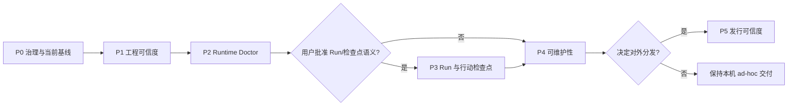

# CodePilot 借鉴分析与 LeanClaw 优化提升执行方案

> 文档状态：P0 已于 2026-07-29 通过用户验收；P1 / T04–T07 已完成并关闭，执行指针移到 T08
>
> 创建日期：2026-07-29
>
> CodePilot 分析快照：`main@215c8f93d213c904a6903b86e7c0a93dab905a16`
>
> LeanClaw 基线：[current-baseline.md](../../current-baseline.md)
>
> 实施批准：2026-07-29，用户要求“按照这个方案开始做”
>
> 适用范围：LeanClaw 下一阶段产品与工程优化；阶段关闭仍需用户明确验收

## 0. 执行摘要

CodePilot 最值得 LeanClaw 借鉴的，不是它拥有 17+ Provider、远程 Bridge、Persona、技能市场等更多功能，而是它逐步形成了五种可复用的工程能力：

1. **用统一契约隔离 Runtime 差异**：UI 消费规范化事件、权限和能力，而不是识别每个 Runtime 的私有形态。
2. **让未知能力和高风险操作默认失败关闭**：不支持就明确标记 `unsupported`，无法判断就要求确认，而不是静默降级成“看起来可用”。
3. **把故障变成结构化诊断和恢复动作**：错误不只是日志文本，而是“分类、原因、影响、下一步”的用户可操作结果。
4. **把计划、护栏、验证证据当作代码的一部分**：任务有生命周期，跨模块不变量有专门护栏，真实 smoke 有持续账本。
5. **把发布当作可验证的产品链路**：源代码、版本、测试、原生模块、产物和发布状态逐层校验。

LeanClaw 已经拥有 CodePilot 很多做法想要达到的底座：独立 Utility Runtime、Task/Run/Step 事实链、集中状态机、Approval/Andon、追加式 RunEvent、Need You 投影、隐私白名单和本机诊断。因此，下一阶段不应该“重造一个 CodePilot”，而应集中补齐四个缺口：

- **工程可信度**：当前事实、CI、历史数据库迁移、故障注入和打包证据形成持续门禁。
- **运行可信度**：Provider、Model、Tool、MCP、Shell、Scheduler 的能力和错误有统一契约。
- **用户接管能力**：用户能快速看懂“现在发生了什么、为什么停下、我该做什么、如何继续”。
- **交付可信度**：只有明确选择对外分发后，才建设签名、公证、升级和正式发布链。

建议按 **P0 治理基线 → P1 工程门禁 → P2 Runtime Doctor → P3 Run/行动检查点 → P4 可维护性 → P5 条件式发行** 顺序推进。每个阶段都设置工程完成和用户验收两道门；用户未明确“验收通过”，不得正式关闭本阶段或开始下一阶段的业务实现。

---

## 1. 分析边界与证据口径

### 1.1 证据分类

本文使用以下口径，避免把观察、推断和计划混在一起：

- **O（Observed）**：在指定提交的源码、文档或本轮命令输出中直接观察到。
- **D（Derived）**：由多个已观察事实推导出的工程判断。
- **R（Recommendation）**：针对 LeanClaw 的建议，尚未实现，也未获得用户验收。
- **U（Unknown）**：当前缺少真实用户、正式证书、历史数据或外部环境，不能下结论。

### 1.2 本次基线

| 项目 | 当前证据 | 结论 |
|---|---|---|
| CodePilot | 固定分析 `215c8f9`，不引用会继续漂移的 `main` 作为事实源 | 本文的外部链接均尽量固定到该提交 |
| LeanClaw | 已验证代码基线 `main@9af111f`，Schema v13 | 以当前代码、远端 CI 与《审计与交接》记录 AV 为现状基线 |
| 本轮验证 | `check:static` 18/18、typecheck、349/349 unit、build、受控 GUI 权限下 43/43 E2E 均通过 | 仅证明本地工作树；GitHub Node 24 Runner 尚未执行 |
| Electron E2E | 本轮只核对清单为 29 个文件、43 条；仓库最近审计记录 43/43 与 s1–s18 18/18 通过 | 这是仓库已有证据，不冒充本轮重跑 |
| 正式发行 | 当前 macOS 构建使用 ad-hoc identity，`hardenedRuntime=false` | 不能宣称已达到对外发行标准 |

### 1.3 许可证边界

CodePilot 当前使用 Business Source License 1.1，并对商业用途设置限制，变更日为 2029-03-16；其源码副本和衍生作品仍受该许可证约束，且不授予商标权（[LICENSE L1-L30](https://github.com/op7418/CodePilot/blob/215c8f93d213c904a6903b86e7c0a93dab905a16/LICENSE#L1-L30)、[L43-L75](https://github.com/op7418/CodePilot/blob/215c8f93d213c904a6903b86e7c0a93dab905a16/LICENSE#L43-L75)）。

因此，本方案只借鉴**设计思想、验证方法和工程策略**，不复制 CodePilot 的源码、组件实现、品牌、素材或产品文案。若未来确实需要移植具体实现，必须先单独完成许可证评估。

---

## 2. CodePilot 可以学习的设计思想

### 2.1 统一 Runtime 契约，而不是让 UI 认识每一种后端

CodePilot 为不同 Runtime 定义统一事件、权限事件、会话引用和能力矩阵；未知事件必须进入显式的 `unknown_item`，不能被静默丢弃（[runtime/contract.ts L1-L27](https://github.com/op7418/CodePilot/blob/215c8f93d213c904a6903b86e7c0a93dab905a16/src/lib/runtime/contract.ts#L1-L27)、[L69-L89](https://github.com/op7418/CodePilot/blob/215c8f93d213c904a6903b86e7c0a93dab905a16/src/lib/runtime/contract.ts#L69-L89)）。它还用 capability contract 把 Runtime、工具暴露、权限和 UI 呈现绑定到同一个事实源（[capability-contract.ts L1-L88](https://github.com/op7418/CodePilot/blob/215c8f93d213c904a6903b86e7c0a93dab905a16/src/lib/harness/capability-contract.ts#L1-L88)）。

对 LeanClaw 的启发不是“立刻接入更多 Runtime”，而是：

- Provider、Model、Tool、MCP、Shell、Scheduler 都应通过声明式能力回答“支持什么、需要什么、为什么不可用”。
- Renderer 只消费共享类型和投影，不读取 Runtime 私有字段。
- 新能力默认不可用；只有契约、实现、测试、UI 四者一致后才开放。
- 未知事件必须留痕并安全降级，不能制造假成功。

### 2.2 权限依据行为，不依据名字；未知情况失败关闭

CodePilot 的 Permission Boundary 明确规定：新工具默认受保护，风险等级依据实际行为而不是工具名前缀，跨 Runtime 的暴露必须通过能力契约；版本未知或回显不一致时要失败关闭（[PermissionBoundary.md L13-L22](https://github.com/op7418/CodePilot/blob/215c8f93d213c904a6903b86e7c0a93dab905a16/docs/guardrails/PermissionBoundary.md#L13-L22)、[L36-L50](https://github.com/op7418/CodePilot/blob/215c8f93d213c904a6903b86e7c0a93dab905a16/docs/guardrails/PermissionBoundary.md#L36-L50)）。

LeanClaw 已经用 `baseRisk/riskFor/dryRun/execute` 描述工具，并通过 Approval/Andon 执行风险控制（[tool-types.ts](../../../src/runtime/tool-types.ts#L21)、[tools.ts](../../../src/runtime/tools.ts#L90)）。下一阶段应该补的是**能力与风险的一致性测试**，而不是新建第二套权限系统。

### 2.3 把错误从“字符串”提升为“诊断结果”

CodePilot 将错误分类为结构化类别，并给出恢复动作；Provider Doctor 又用多个探针区分 CLI、认证、Provider 和环境问题（[error-classifier.ts L90-L150](https://github.com/op7418/CodePilot/blob/215c8f93d213c904a6903b86e7c0a93dab905a16/src/lib/error-classifier.ts#L90-L150)、[provider-doctor.ts L1-L81](https://github.com/op7418/CodePilot/blob/215c8f93d213c904a6903b86e7c0a93dab905a16/src/lib/provider-doctor.ts#L1-L81)）。同时用 200 条上限的环形日志并进行脱敏和长度限制，避免诊断本身扩大隐私面（[runtime-log.ts L1-L14](https://github.com/op7418/CodePilot/blob/215c8f93d213c904a6903b86e7c0a93dab905a16/src/lib/runtime-log.ts#L1-L14)、[L36-L78](https://github.com/op7418/CodePilot/blob/215c8f93d213c904a6903b86e7c0a93dab905a16/src/lib/runtime-log.ts#L36-L78)）。

LeanClaw 已有 Runtime Center、Provider 测试、健康摘要和隐私安全的诊断导出（[RuntimeCenter.tsx](../../../src/renderer/src/RuntimeCenter.tsx#L16)、[diagnostics.ts](../../../src/main/diagnostics.ts#L1)）。可借鉴方向是把它升级成：

`探针 → 结构化 finding → 影响范围 → 安全修复动作 → 验证结果`

而不是再增加一个只展示更多日志的新页面。

### 2.4 执行计划有生命周期，问题处理形成闭环

CodePilot 把执行计划分为 `active/completed/deferred/superseded`，并规定 AI 只能从 active 领取任务（[exec-plans/README.md L1-L26](https://github.com/op7418/CodePilot/blob/215c8f93d213c904a6903b86e7c0a93dab905a16/docs/exec-plans/README.md#L1-L26)）。问题处理遵循 `Signal → Triage → Fix → Verify → Guardrail`，P1/P2 问题不能只靠聊天确认关闭（[L35-L60](https://github.com/op7418/CodePilot/blob/215c8f93d213c904a6903b86e7c0a93dab905a16/docs/exec-plans/README.md#L35-L60)）。计划模板要求记录决策和真实 Smoke Ledger（[L62-L96](https://github.com/op7418/CodePilot/blob/215c8f93d213c904a6903b86e7c0a93dab905a16/docs/exec-plans/README.md#L62-L96)）。

LeanClaw Phase 2 已有较强的 T01–T10 顺序、DoD 和用户验收门。值得增补的是：

- 当前计划与历史计划的目录语义；
- 可机读状态与单一当前入口；
- 真实环境验证账本；
- 同类问题复发时必须沉淀 guardrail；
- “工程完成”和“用户验收”继续保持两个状态。

### 2.5 用模块护栏保存不变量，而不只写架构概览

CodePilot 的 guardrail 文档要求至少覆盖词汇表、不变量、关键文件、改动检查表、常见坑、测试映射和决策日志（[guardrails/README.md L25-L40](https://github.com/op7418/CodePilot/blob/215c8f93d213c904a6903b86e7c0a93dab905a16/docs/guardrails/README.md#L25-L40)）。这类文档的价值在于：未来任何人修改 Runtime、权限、数据库或发布链之前，能先看到“不允许破坏什么”。

LeanClaw 首批护栏应只覆盖高风险且跨文件的稳定边界：

1. `Task/Run/Step + transition()` 状态事实；
2. Tool Risk / Approval / Andon；
3. Renderer 数据白名单和隐私脱敏；
4. SQLite migration 与历史 fixture；
5. Automation 与普通 Task 共用执行链；
6. Package / Release 事实与验收术语。

不要给每个小模块都写一份护栏；只有跨多个文件、已经发生过误改或后果严重的边界才需要。

### 2.6 UI 分层和体积预算是防漂移工具

CodePilot 将 UI 分成 primitives、patterns、feature、app、hooks，要求使用语义 token，并对大型组件设置治理规则和视觉验证（[ui-governance.md L1-L20](https://github.com/op7418/CodePilot/blob/215c8f93d213c904a6903b86e7c0a93dab905a16/docs/ui-governance.md#L1-L20)、[L57-L80](https://github.com/op7418/CodePilot/blob/215c8f93d213c904a6903b86e7c0a93dab905a16/docs/ui-governance.md#L57-L80)）。

LeanClaw 当前 `TaskWorkspace.tsx`、`Automations.tsx`、`Settings.tsx`、`Agents.tsx`、`App.tsx`、`runtime/api.ts` 和 `shared/types.ts` 已经承担较多职责。可借鉴的是**行为锁定后的边界拆分和体积预警**，而不是为了目录好看做大重构，也不需要为此新增 UI 依赖。

### 2.7 发布状态必须有可复现含义

CodePilot 对 `Code complete / Tests pass / Smoke passed / Review passed / Release ready / Shipped` 进行区分（[reporting.md L1-L19](https://github.com/op7418/CodePilot/blob/215c8f93d213c904a6903b86e7c0a93dab905a16/docs/rules/reporting.md#L1-L19)），并在 tag 发布流程中校验源代码、版本、测试门和打包产物（[build.yml L1-L17](https://github.com/op7418/CodePilot/blob/215c8f93d213c904a6903b86e7c0a93dab905a16/.github/workflows/build.yml#L1-L17)、[L151-L208](https://github.com/op7418/CodePilot/blob/215c8f93d213c904a6903b86e7c0a93dab905a16/.github/workflows/build.yml#L151-L208)）。

LeanClaw 应沿用更严格的状态链：

`Code complete → Tests pass → Packaged smoke pass → Review pass → Engineering accepted → User accepted → Release ready → Shipped`

任何前置状态都不能替代后置状态，尤其不能把“文档写完”“测试通过”或“本机能打开”写成“已发布”。

---

## 3. 不应照搬的部分

### 3.1 不把 LeanClaw 改造成聊天与 Persona 产品

CodePilot 的核心叙事是通用 AI Agent 桌面客户端，包含 Assistant Workspace、Persona、Persistent Memory、双栏会话、远程 Bridge、Media Studio 和 17+ Provider（[README L36-L69](https://github.com/op7418/CodePilot/blob/215c8f93d213c904a6903b86e7c0a93dab905a16/README.md#L36-L69)）。

LeanClaw 的产品事实仍然是：

- Agent 是执行配置，不是聊天人格；
- Task 是持续验收的工作目标；
- Run 是执行上下文，Step 是确定性步骤；
- Runtime 只代表当前本机执行环境；
- Need You 是现有安全状态的投影；
- Automation 继续创建普通 Task，不建设平行执行系统。

Persona、长期记忆、聊天历史、远程 IM、技能市场和多用户协作都不进入本方案。

### 3.2 不复制 CodePilot 的 checkpoint 实现

CodePilot 的会话 rewind/checkpoint 交互值得学习，但其文件 checkpoint 当前采用进程内、按会话保存、最多 20 个的 best-effort 实现（[file-checkpoint.ts L34-L60](https://github.com/op7418/CodePilot/blob/215c8f93d213c904a6903b86e7c0a93dab905a16/src/lib/file-checkpoint.ts#L34-L60)），恢复单个文件失败后会继续处理而不向上抛出（[L123-L150](https://github.com/op7418/CodePilot/blob/215c8f93d213c904a6903b86e7c0a93dab905a16/src/lib/file-checkpoint.ts#L123-L150)）。LeanClaw 不能用这种方式处理 Task 的可审计恢复。

LeanClaw 若建设“行动检查点”，必须复用 SQLite、RunEvent、Evidence、Approval、Andon 和 Verification，所有恢复动作都经过现有状态机和安全 RPC，不做隐藏的文件回滚。

### 3.3 不复制明文凭据和本地 Hook 依赖

CodePilot 自己的技术债记录承认 Provider 凭据仍可能明文存入 SQLite，也承认模型能力未完全按 Runtime 区分（[tech-debt-tracker.md L50-L51](https://github.com/op7418/CodePilot/blob/215c8f93d213c904a6903b86e7c0a93dab905a16/docs/exec-plans/tech-debt-tracker.md#L50-L51)）。LeanClaw 已经使用 Electron `safeStorage` 和 Renderer 白名单，不应倒退。

CodePilot 的本地 pre-commit 会执行 fail-closed 分类、typecheck 和单测，并专门隔离测试数据库（[.husky/pre-commit L1-L35](https://github.com/op7418/CodePilot/blob/215c8f93d213c904a6903b86e7c0a93dab905a16/.husky/pre-commit#L1-L35)）；LeanClaw 可以借鉴其快速反馈，但远端 CI 必须独立成立，不能因为开发者没有安装 Hook 就绕过检查。Hook 不能作为唯一发布门。

### 3.4 不把自动文档检查当成语义真实

CodePilot 的技术债也明确记录：docs drift linter 可以查链接和结构，但无法判断计划状态是否与代码真实状态一致（[tech-debt-tracker.md L59-L59](https://github.com/op7418/CodePilot/blob/215c8f93d213c904a6903b86e7c0a93dab905a16/docs/exec-plans/tech-debt-tracker.md#L59-L59)）。

LeanClaw 可以自动检查索引、链接、状态字段和产物存在性，但“实现完成”“用户接受”“真实运行成功”仍必须由可复现证据和人工验收确认。

---

## 4. LeanClaw 当前基线与真正缺口

### 4.1 已经具备，不应重复立项

| 已有能力 | 当前事实源 | 方案约束 |
|---|---|---|
| 独立 Runtime | Main 用 Utility Process 启动本机 Runtime | 不再新建第二个前端运行态管理器 |
| 单一状态迁移 | 正常业务状态写入经 `transition()`；创建初态与崩溃恢复为受控例外（[state.ts](../../../src/runtime/state.ts#L15)、[State 护栏](../../guardrails/State.md)） | UI 不得直接改 Task 状态；不得新增未记录的直写例外 |
| Task/Run/Step 事实链 | SQLite 保存执行、工具、模型、证据、验证和事件（[db.ts](../../../src/runtime/db.ts#L21)） | 新能力复用主链，不建平行账本 |
| 风险控制 | Tool Risk、Dry Run、Approval、Andon、预算、Verification 已存在 | 只增强契约和一致性测试 |
| Need You | 从 Approval、Andon、验证失败和失败 Task 投影（[need-you.ts](../../../src/runtime/need-you.ts#L35)） | 不建新的 inbox 表 |
| Runtime 可见性 | Runtime Center 已有状态、连接测试、用量和诊断入口（[RuntimeCenter.tsx](../../../src/renderer/src/RuntimeCenter.tsx#L16)） | 在原页升级 Doctor，不新建监控墙 |
| 隐私边界 | Renderer 采用共享白名单脱敏，诊断导出有独立隐私处理（[privacy.ts](../../../src/shared/privacy.ts#L1)） | 新诊断不得回传密钥、完整私密路径或任意 payload |
| 性能优化 | Schema v13 索引、TaskSummaryView、固定批量查询已经落地（[审计与交接.md](../../审计与交接.md#L762)） | 不再把“1000 Task 列表优化”列为未完成项 |

### 4.2 当前需要优先处理的缺口

1. **当前事实漂移（T00 已清偿）**：已建立 [current-baseline.md](../../current-baseline.md)，并把 Phase 2 的 Schema v12/326 单测标为 2026-07-23/24 历史验收快照；当前代码基线是 Schema v13/345 单测。
2. **远端工程门禁不足**：仓库没有完整的 PR/main CI、lint/static-analysis 和 release workflow；开发机通过不等于其他环境可复现。
3. **迁移证据不完整**：现有 v8 E2E fixture 按历史列定义重建，不是真实历史数据库副本，无法覆盖未知索引、约束和用户数据组合。
4. **故障路径仍有空白**：Automation “认领先推进、失败不回滚”的语义缺少真实 Runtime DB 故障注入；TaskSummary SQL 与 push 派生缺少逐字段/逐字节对拍。
5. **能力与诊断未统一**：Provider 测试和 Runtime Center 已存在，但还没有覆盖 Provider/Model/Tool/MCP/Shell/Scheduler 的统一能力矩阵、错误分类和修复动作。
6. **Run 历史语义不完整**：`refineTask` 当前复用最新 Run，Run Inspector 也只取最新 Run；“一次执行形成一个可审计 Run”仍需产品决策和迁移方案，不能直接假定。
7. **模块职责偏重**：Renderer 和 Runtime 中数个文件已经较大，未来继续加功能会放大回归面；需要测试先行的边界拆分。
8. **正式发行链缺失**：当前只适合本机 ad-hoc 打包；是否需要 Developer ID、hardened runtime、公证和自动升级，取决于用户是否决定对外分发。
9. **依赖风险需动态复核**：历史审计中的 advisory 数量会漂移，必须联网刷新并按生产可达性、修复代价和非降级路径分类，不能机械追求“数字清零”。
10. **模型 fallback 缺少故障语义**：当前只要配置了 fallback，primary 抛出的任何错误都会尝试 fallback；如果 fallback 也失败，最终重新抛出 primary 错误，第二条失败原因只留在 model call 行中，用户无法看到完整因果链（[model.ts](../../../src/runtime/model.ts#L495)）。需要先分类“可重试/可替代/必须停线”，再决定是否 fallback。

---

## 5. 优化路线总览

### 5.1 原则

1. **先证据，后改造**：P0/P1 完成前，不开始新的业务能力实现。
2. **一次只执行一个任务**：严格按任务依赖顺序推进；只有标记为可并行且不共享文件的验证工作才可并行。
3. **契约先于 UI**：能力、错误、Run 语义和投影类型先冻结，再改页面。
4. **行为先锁定，再重构**：清理或拆分前先补回归测试；优先删除和复用，不引入无必要的新层。
5. **不新增依赖**：任何新依赖、更新框架或发布 SDK 都要单独提交理由、替代方案和风险，由用户批准。
6. **安全默认失败关闭**：未知能力、未知版本、未知事件和高风险操作不自动放行。
7. **用户验收单独成门**：工程绿灯不等于阶段关闭。

### 5.2 阶段与优先级

| 阶段 | 目标 | 优先级 | 预计工作量* | 结束检查点 |
|---|---|---:|---:|---|
| P0 治理与基线 | 建立唯一当前事实、计划生命周期和护栏 | 必做 | 3–5 人日 | CP0 基线评审 |
| P1 工程可信度 | CI、迁移、故障路径、包验证可复现 | 必做 | 7–10 人日 | CP1 工程门禁 |
| P2 Runtime Doctor | 能力、错误、探针、恢复动作统一 | 必做 | 8–12 人日 | CP2 故障演练 |
| P3 Run 与行动检查点 | 让执行历史可审计、停线可接管 | 推荐，需产品批准 | 10–15 人日 | CP3 真实任务验收 |
| P4 可维护性 | UI/Runtime 边界收敛，降低变更半径 | 推荐 | 7–10 人日 | CP4 无行为回归 |
| P5 发行可信度 | 签名、公证、升级、正式发布 | 条件式 | 8–15 人日 | CP5 干净环境验收 |

\* 仅表示单人等价工程量级，不是交付承诺；P3/P5 会受到产品决策、真实账号、证书和外部服务影响。

### 5.3 依赖关系

---

## 6. 分阶段任务拆解

### P0：治理与当前基线

#### 阶段目标

让任何下一位实施者都能从一个入口准确回答：当前版本是什么、哪些能力已完成、哪些只是历史记录、当前计划从哪里领取、什么条件才算完成。

当前进度：**T00–T03 工程完成；CP0 已于 2026-07-29 通过用户验收。**

#### 任务

| ID | 任务 | 主要产物 | 依赖 | 验收标准 |
|---|---|---|---|---|
| T00 | 建立当前基线页 | `docs/current-baseline.md` 或等价唯一入口；记录 HEAD、Schema、测试清单、打包方式、已知缺口和刷新日期 | 无 | 不再出现把 v12/326 当作当前事实；历史文档明确标注历史时点 |
| T01 | 建立计划生命周期 | `docs/exec-plans/{active,completed,deferred,superseded}`、索引和状态字段 | T00 | 只有 active 可领取；移动计划保留原因、日期和重启条件 |
| T02 | 建立首批模块护栏 | State、Permission、Privacy、Migration、Automation、Release 六份或更少的高风险 guardrail | T00 | 每份包含不变量、关键文件、检查表、测试映射和决策日志 |
| T03 | 固化阶段验收模板 | 工程状态、Smoke Ledger、用户验收、未测边界、回滚说明模板 | T01–T02 | “完成/测试通过/用户验收/已发布”具有不同字段，不能互相替代 |

#### CP0：基线评审

进入 P1 前必须同时满足：

- 当前基线可从代码和命令复现；
- 文档无已知的“当前数值”冲突；
- 本方案的范围、非目标、顺序和验收口径经用户确认；
- 用户明确同意开始实施，而不是仅同意阅读文档。

验收记录：[P0 / CP0 阶段验收记录](../../acceptance/leanclaw-codepilot-optimization-P0.md)。工程裁决与用户裁决均为 `accepted`；P0 正式关闭，执行指针移到 P1/T04。

---

### P1：工程可信度

#### 阶段目标

让 LeanClaw 的核心门禁在干净环境中自动、独立、失败关闭地运行；优先补齐已知证据空白，不新增业务能力。

#### 任务

| ID | 任务 | 实施要点 | 依赖 | 验收标准 |
|---|---|---|---|---|
| T04 | 建立远端 CI 基线 | PR/main 上执行安装、typecheck、lint/static check、unit、build；E2E/packaged smoke 按平台分层 | CP0 | 任一必要门失败则 CI 失败；不依赖本地 Hook；结果和日志可追溯 |
| T05 | 测试数据与真实数据强隔离 | 所有测试在 import 前固定临时 HOME/数据根；以路径限制、权限和访问拦截实现 deny-by-construction | T04 | 自动测试无法读取、复制或修改真实 DB/配置；越界访问会立即失败；临时目录可清理 |
| T06 | 历史数据库迁移证据 | 优先用历史 schema/旧二进制生成合成边界 fixture；覆盖 v8→v13+、重复启动、失败回滚和未知索引/约束 | T05 | fixture 来源和生成方法可复现；若确需用户旧库，必须单独授权，在离线副本先脱敏再进入测试；迁移事务性、幂等性和数据保持均有断言 |
| T07 | 已知故障路径补洞 | TaskSummary 两条派生路径对拍；Automation DB 故障注入；恢复/停止后的队列与状态一致性 | T05 | 故障不会制造假成功、重复 Task 或无提示跳过；事件和 UI 结论一致 |
| T08 | 打包产物验证 | 校验应用版本、Electron/native ABI、schema 启动、Runtime 健康、核心 Journey 和产物 hash | T04–T07 | 新打包 `.app` 在隔离数据根通过；验证针对最终产物，不复用旧 `.app` |
| T09 | 依赖风险刷新与决策 | 联网刷新生产/开发依赖；按可达性、修复方式、降级风险分类 | T04 | 每个保留 advisory 有影响分析、缓解措施、复查日期；不为清零而盲目降级 |

T04 已完成并关闭：[`ci.yml`](../../../.github/workflows/ci.yml)、[`docs/ci.md`](../../ci.md)、Node LTS 固定、静态治理与 fail-closed 测试均已落盘；本地干净安装、349/349 unit、build 和 43/43 Electron E2E 已通过。仓库已公开并为 `main` 启用严格 Branch Protection：`Quality` 与 `Electron E2E` 都是 Required Check，管理员同样受约束，禁止强推和删除。临时 PR #2 的确定性失败使 Quality 失败、Electron E2E 跳过，GitHub 返回 `mergeStateStatus=BLOCKED`；证据取得后 PR 和分支均已清理。执行指针移到 T05。

T05 已完成并关闭：Vitest、Playwright 和 Runtime smoke 会在 import/启动前创建独立 test root/home/data/tmp；Main、Utility Runtime、MCP 子进程、文件工具、Shell cwd 与导出路径均加入测试根硬边界。越界、符号链接逃逸、过宽 `allowedDirs` 和场景覆盖隔离变量都有失败反证。本地 static 22/22、typecheck、357/357 unit、build、Runtime smoke 与 44/44 Electron E2E 通过，临时根无残留；[PR #4 最终 run 30457091843](https://github.com/Eleven1111/LeanClaw/actions/runs/30457091843) 和合并后的 [`main` run 30457521961](https://github.com/Eleven1111/LeanClaw/actions/runs/30457521961) 也通过 `Quality` 与 `Electron E2E`。详细契约见 [`docs/test-isolation.md`](../../test-isolation.md)。执行指针移到 T06，T08 的最终 `.app`/CDP 验证不前移。

T06 已完成并关闭：新增 `npm run migration:evidence`（Node 编排 + `ELECTRON_RUN_AS_NODE` 真实 SQLite），13 个场景覆盖空库→v13、v12→v13、old-binary v8→v13、新库与升级库结构指纹对拍、3 个未知对象保持、连续三次启动幂等、v14 库拒绝、版本台账多行/文本/负数/小数拒绝、0 行台账 bootstrap、固定注入点整体回滚与回滚后向前恢复。fixture 由锚点提交 `15831e5` 自己的 `initDb()` 创建（`source_kind: synthetic-old-binary`），生成脚本、manifest、checksum 与语义指纹可追溯，全程未接触真实 `~/.leanclaw`。实现侧最小修正：`pendingMigrations()` 对更高版本抛 `schema-too-new`、`readSchemaVersion()` 强制单行非负整数、新增 `applyMigrations()` 迁移应用边界并把 bootstrap 纳入同一事务、`initDb()` 失败不发布半成品连接。本地 static 22/22、typecheck、363/363 unit、迁移证据 13/13、build、Runtime smoke 与 45/45 Electron E2E 通过。开发态迁移不冒充 packaged migration，最终 `.app` 旧库升级仍在 T08。[PR #6 run 30517200723](https://github.com/Eleven1111/LeanClaw/actions/runs/30517200723) 通过 `Quality` 55s 与 `Electron E2E` 4m19s；squash merge 为 `main@a91c39a` 后，[`main` run 30517494478](https://github.com/Eleven1111/LeanClaw/actions/runs/30517494478) 再次通过，`Quality` 1m05s、`Electron E2E` 3m38s，两轮日志都含「迁移证据台账：13/13 PASS」与 45 条 E2E。详见 [Migration 护栏](../../guardrails/Migration.md) 与 [记录 AY](../../审计与交接.md)。执行指针移到 T07。

T07 已完成并关闭：新增 `npm run parity:evidence`（与迁移证据共用 Electron 证据启动器）对 `TaskSummaryView` 的两条派生路径做真实 SQLite 逐字节对拍，首次运行即发现 `listTaskSummaries()` 的 `lastDoneLabel` 未脱敏、会把 Task 私有绝对路径送进 Renderer，已修复为与完整视图共享同一脱敏规则。Automation 在真实 Runtime 内用可移除的 `BEFORE INSERT ... RAISE(ABORT)` 触发器注入 DB 故障：事务整体回滚、无 Task 落地、无孤儿事件、Need You 为空、Runtime 存活，移除故障后只创建一个 Task。同时发现失败在 UI 上表现为假成功（卡片只显示下次运行与上一个 Task），新增派生字段 `lastTriggerFailed` 与卡片「触发失败 · 未创建任务，原因见诊断」，仅由既有两列推导，不新增 Schema。「认领先推进、失败不回滚 `next_run_at`」经裁决**保持**并记录为接受风险：回退会把坏计划变成每 tick 热重试。队列一致性以摘要/明细的 `status` 与 `queuePosition` 相等、`stopTask` 后队列清空且状态收敛为断言。本地 static 22/22、typecheck、367/367 unit、迁移证据 13/13、对拍 5/5、build、Runtime smoke 与 46/46 Electron E2E 通过。[PR #8 run 30523391877](https://github.com/Eleven1111/LeanClaw/actions/runs/30523391877) 通过 `Quality` 1m17s 与 `Electron E2E` 4m02s；squash merge 为 `main@16809b9` 后，[`main` run 30523728447](https://github.com/Eleven1111/LeanClaw/actions/runs/30523728447) 再次通过，`Quality` 1m08s、`Electron E2E` 3m01s，两轮日志都含「迁移证据台账：13/13 PASS」「双路径对拍台账：5/5 PASS」与 46 条 E2E。详见 [Privacy 护栏](../../guardrails/Privacy.md) 与 [记录 AZ](../../审计与交接.md)。执行指针移到 T08。

T08 工程实现完成，等待远端 Required Checks 与合并后才关闭：新增受控 launcher `tests/packaged-verify.mjs`（`npm run verify:packaged`），先 `rm -rf release && npm run dist:mac` 重新生成产物，脚本用 `find -newer` 拒绝比源码更旧的包，被验证的二进制取自**解压后的 ZIP**，隔离根在启动 packaged app 之前安装。台账 10/10：产物新鲜度、DMG `hdiutil verify` + SHA-256 `9006f9b1…`、ZIP `unzip -t` + SHA-256 `b98da328…`、版本 `0.1.0` 与 Bundle ID、Electron `43.1.0` 与 arm64 `better_sqlite3.node`、`codesign --verify --deep --strict` 通过且反向断言 `Signature=adhoc`、空数据根首启 `schema_version=13` + Journey A `delivered`、以及用 T06 old-binary v8 fixture 证明**最终 `.app` 的 v8→v13 升级**（关键值与三个未知对象保持、`idx_*` 14 个、升级后 Journey A 仍 `delivered`）。这关闭了基线里最后一个 P0——开发态迁移与 packaged migration 现在是两份独立且可对照的证据。回归：static 22/22、typecheck、367/367 unit、迁移证据 13/13、对拍 5/5、smoke、46/46 E2E。仍是 ad-hoc 签名、未公证、未接入 updater，状态只到 `Packaged smoke pass`。详见 [记录 BA](../../审计与交接.md) 与 [本机打包](../../本机打包.md)。

#### CP1：工程门禁

- CI 在一个故意失败的分支上能证明自己会拦截；
- 当前单测、构建、相关 E2E、s1–s18 和全新打包验证通过；
- 自动测试通过 deny-by-construction 证明无法访问真实用户数据；
- 旧数据库 fixture 有明确来源；任何私有旧库的读取/复制都有用户单独授权、离线脱敏和销毁记录；
- Automation 故障路径有可复现证据；
- 用户对工程基线验收通过后，才进入 P2。

---

### P2：统一能力契约与 Runtime Doctor

#### 阶段目标

用户不需要阅读原始日志，就能知道当前本机的 Provider、Model、Tool、MCP、Shell 和 Scheduler 是否可用；不可用时知道原因、影响和安全的下一步。

#### 任务

| ID | 任务 | 实施要点 | 依赖 | 验收标准 |
|---|---|---|---|---|
| T10 | 定义 Capability Contract | 为 Provider/Model/Tool/MCP/Shell/Scheduler 定义 `supported/degraded/unavailable/unknown`、原因码和必要前置条件 | CP1 | Shared 类型是唯一契约；未知默认不可用；Renderer 不读私有 Runtime 字段 |
| T11 | 建立结构化错误分类 | 统一认证、额度、网络、模型不兼容、工具权限、MCP 启动、Shell、DB、Scheduler 等错误；保留 primary/fallback 双因果链 | T10 | 每类包含稳定 code、用户文案、可重试性、影响范围和安全 recovery action；只有明确可替代的错误才 fallback |
| T12 | 实现分级诊断探针 | Passive probe 只读本地状态；Active probe 可能联网、spawn、刷新认证或产生费用，必须明示副作用并按风险确认 | T10–T11 | 两类探针不可混淆；Active probe 有预算、timeout、取消、幂等和凭据边界；失败本身也返回结构化 finding |
| T13 | 升级现有 Runtime Center | 在原页面增加结论优先的 Doctor：状态、原因、影响、动作、验证结果；复用现有诊断导出 | T12 | 不新增监控墙；用户从 finding 可直达正确设置或已有安全 RPC |
| T14 | 契约与故障 E2E | 覆盖未知能力、过期凭据、Provider 不兼容、primary/fallback 双失败、MCP 崩溃、Shell 缺失、Scheduler/DB 故障 | T13 | UI、RPC、日志和诊断包结论一致；双失败不丢因果链；无 token、完整私密路径或任意 payload 泄漏 |

#### CP2：故障演练

用固定命名的故障矩阵覆盖至少五类故障；每个场景记录 scenario ID、seed/fixture、注入点、期望 finding 和恢复后状态。随机 fuzz 只作附加探索，不作为唯一验收证据。逐项验证：

1. 30 秒内可定位到稳定类别；
2. 页面说明“原因、影响、下一步”，不只显示错误码；
3. Active probe 和修复动作都不会绕过 Approval/Andon/Settings 权限，网络、进程、费用和凭据副作用在执行前可见；
4. 导出的诊断包通过隐私审查；
5. 故障解除后能重新探测并显示恢复；
6. 用户明确验收 Runtime Doctor 后才进入 P3。

---

### P3：Run 历史与行动检查点

#### 阶段目标

让用户在 Task Workspace 中快速回答：

- 这个 Task 经历过几次执行？
- 当前一次为什么运行、暂停、等待或失败？
- 我现在需要做什么？
- 执行动作后从哪里继续？
- 哪些证据证明这一轮完成？

#### 决策门

P3 会触及产品语义和可能的 Schema 变更。实施前必须先由用户批准：

- `refineTask` 是创建新 Run，还是继续当前 Run；
- 终止、重试、追加预算、批准后的 Run 边界；
- 历史 Run 的保留、归档、删除和隐私策略；
- “检查点”只恢复执行上下文，还是允许文件恢复；本方案默认**不做隐式文件回滚**。

#### 任务

| ID | 任务 | 实施要点 | 依赖 | 验收标准 |
|---|---|---|---|---|
| T15 | Run 语义 ADR 与测试规格 | 用状态图和场景表定义 start/refine/retry/resume/stop/complete | CP2 + 用户决策 | 每条转换有唯一 Run 归属、状态、事件和 UI 文案；先评审，不先改代码 |
| T16 | Run 历史数据与 API | 在兼容旧库的前提下支持按 Task/Run 查询；迁移和投影保持隐私白名单 | T15 | 历史 fixture 通过；旧 Task 可读；列表不因加载完整 Run 历史而退化 |
| T17 | Action Checkpoint 投影 | 从 Task、当前 Run、Approval、Andon、Verification、Evidence 推导单一行动摘要 | T16 | 不建平行事实表；同一事实只出现一次；每个动作复用现有安全 RPC |
| T18 | Task Workspace 与 Inspector | Workspace 先展示行动摘要和 Run 时间线；Inspector 保留技术下钻 | T17 | 不打开 Inspector 也能说清现状和下一步；技术明细不污染用户 Activity |
| T19 | 恢复与接管 E2E | 覆盖暂停、批准、拒绝、追加预算、验证失败、refine、新 Run、应用重启 | T18 | 重启后可继续；无重复执行；历史可审计；恢复动作最多两步可达 |

#### CP3：真实任务验收

使用至少 3 个真实但不含敏感生产数据的任务完成试运行：

- 用户在 30 秒内判断当前状态和下一步；
- 用户能区分 Task、Run、Step；
- 用户能从失败/待批准状态恢复并继续；
- Run 历史、Activity、Need You、Runtime 状态不矛盾；
- 用户明确说“验收通过”，P3 才关闭。

---

### P4：可维护性与 UI 治理

#### 阶段目标

在不改变行为的前提下缩小高频变更文件的职责和回归半径，为后续功能留出稳定边界。

#### 任务

| ID | 任务 | 实施要点 | 依赖 | 验收标准 |
|---|---|---|---|---|
| T20 | UI Governance | 定义 primitive/pattern/feature/page/hook 边界、语义 token、图标、可访问性和体积预警 | CP3 或 CP2 后明确跳过 P3 | 规则有现有代码示例和例外流程，不为了规则引入依赖 |
| T21 | Renderer 行为锁定与拆分 | 优先处理 App、TaskWorkspace、TaskActivityFeed、Automations、Settings、Agents；一次只处理一个 smell | T20 | 先有回归测试/稳定帧；复用现有组件；无业务逻辑进入 primitive |
| T22 | Runtime API/类型边界拆分 | 按领域拆分 `runtime/api.ts` 和 `shared/types.ts` 的职责，保持 RPC 兼容 | T21 | 无循环依赖、无重复类型、preload/RPC/Renderer 契约全量通过 |
| T23 | 视觉与可访问性门禁 | 覆盖 900×600、标准窗口、空/加载/错误/长内容、高风险动作和键盘路径 | T21–T22 | console/page error 为零；关键页面有稳定视觉证据；用户路径不回退 |

#### CP4：无行为回归

- 所有旧行为由测试和人工路径证明保持；
- 没有新增依赖或无第二消费者的抽象；
- 代码量变化能解释，优先删除重复逻辑；
- 当前全量门禁、打包验证和关键性能指标不退化；
- 用户完成视觉和主流程验收。

---

### P5：条件式发行可信度

#### 阶段目标

只有当用户决定把 LeanClaw 分发给本机之外的真实用户时，才把当前 ad-hoc 构建升级成可验证的发行系统。

#### 决策门

先选择其一：

- **A. 继续本机自用**：保留 ad-hoc 打包，补清晰的手工升级、备份和回滚说明，不接自动更新。
- **B. 小范围测试分发**：Developer ID + hardened runtime + notarization + 固定下载源，先手工更新。
- **C. 正式外部分发**：在 B 基础上增加自动更新、分批发布、回滚、隐私与支持流程。

#### 任务

| ID | 任务 | 实施要点 | 依赖 | 验收标准 |
|---|---|---|---|---|
| T24 | 分发 ADR 与威胁模型 | 明确目标用户、平台、证书、下载源、更新权、数据迁移和回滚 | CP4 | 外部条件、成本、隐私和停止条件书面批准 |
| T25 | 签名、公证与产物证明 | Developer ID、hardened runtime、entitlements、notarization、checksum/SBOM（如需要） | T24 选择 B/C | 干净 macOS 通过 Gatekeeper；最终产物 hash、版本、签名和公证可核验 |
| T26 | 更新与回滚 | 仅在选择 C 且单独批准依赖后实施 updater；支持 staged rollout 和失败回退 | T25 | 旧版本→新版本→回滚路径在真实签名产物上通过，用户数据不丢失 |
| T27 | Release workflow | Preview 与 Stable 分流；tag、版本、测试、签名、产物、发布说明和状态严格关联 | T25/T26 | Preview 不污染 Stable；失败不创建“已发布”假象；Shipped 有真实下载证据 |

#### CP5：干净环境验收

- 使用未安装开发工具的干净账户或机器；
- 验证安装、首次启动、Provider 配置、首个 Task、诊断、重启、升级/回滚；
- 验证签名、公证、版本、hash 和发布说明；
- 用户明确接受后才标记 `Shipped`。

---

## 7. 全局检查节点与 Definition of Done

### 7.1 每个任务开始前

- 已确认任务依赖均通过；
- 已打开相关 guardrail 和当前计划；
- 已写清用户可见变化、本任务不做什么、风险和回滚；
- 清理/重构任务已有行为保护；功能任务已有失败测试或可复现旧行为；
- 涉及 Schema、权限、隐私、发布或依赖时完成专项评审。

### 7.2 每个任务工程完成

- typecheck、unit、build 通过；
- 相关 E2E/smoke/packaged journey 通过；
- UI 变更验证标准窗口与 900×600、空/错/加载/长内容状态；
- 无 console error、page error、未处理 promise；
- 测试在受限临时 HOME/数据根运行，越界访问会失败；没有访问真实用户数据；
- 文档、计划状态、Smoke Ledger 和审计记录同步；
- Lore commit 说明约束、取舍、已测与未测；
- 明确列出剩余风险，不以“看起来正常”代替证据。

### 7.3 每个阶段关闭

- 阶段内任务全部达到工程完成；
- 阶段级回归和最终新打包产物验证通过；
- 当前基线已刷新，旧状态不会误导下一位实施者；
- 用户完成指定真实路径并明确验收；
- 只有用户说“验收通过”后，计划才从 active 移到 completed。

---

## 8. 风险、停止条件与回滚

| 风险 | 早期信号 | 停止/回滚条件 |
|---|---|---|
| 把借鉴变成功能堆叠 | 出现 Persona、远程 Bridge、市场、多用户等支线 | 立即移出 active；没有独立用户证据不重启 |
| 契约与 UI 双事实源 | 同一能力在 Shared、Runtime、Renderer 各自维护 | 停止 UI 实现，先收敛单一事实源和契约测试 |
| 诊断泄漏隐私 | finding/log 中出现 token、完整私密路径、任意 payload | 阻断合并；先修脱敏和 allowlist |
| Schema 破坏旧数据 | fixture 迁移失败、重复迁移、事务外写入 | 回滚迁移代码；不得用“重建数据库”作为用户方案 |
| 重构扩大范围 | 新增抽象多于删除重复、一次跨多个 smell | 拆回单一 smell，小步提交 |
| CI 只在本机成立 | Hook 通过但远端缺门禁 | 不得进入 Release ready |
| 签名/更新条件不足 | 缺证书、稳定下载源或回滚机制 | P5 保持 deferred，继续使用本机 ad-hoc 流程 |
| 文档状态假精确 | 自动检查通过但实现/用户验收无证据 | 状态降级为 Unknown/未验收，补复现证据 |

---

## 9. 明确暂缓的候选

以下能力只有出现真实用户需求、可复现痛点和独立立项后才讨论：

- 多 Runtime 平台化；
- 17+ Provider 扩张；
- Persona、长期记忆和 Assistant Workspace；
- 远程 IM/Bridge；
- Skills 市场；
- 多用户、云同步和团队协作；
- Windows/Linux 全平台发行；
- Generative UI、Media Studio；
- 隐式文件 rewind。

这些不是“永远不做”，而是当前没有证据证明它们比工程可信度、诊断、行动接管和发行安全更优先。

---

## 10. 建议的第一批执行顺序

本方案获批后，建议只创建并依次执行以下首批任务，不提前展开 P2–P5：

1. **T00 当前基线页（已完成）**：消除 v12/326 与 v13/345 的当前事实冲突。
2. **T01 计划生命周期（已完成）**：建立唯一 active 入口。
3. **T02 首批 guardrail（已完成）**：已建立 [State](../../guardrails/State.md)、[Privacy](../../guardrails/Privacy.md)、[Migration](../../guardrails/Migration.md) 和 [guardrail 索引](../../guardrails/README.md)；Permission、Automation、Release 仅保留为按需候选，不冒充已完成。
4. **T03 验收模板（已完成）**：已建立 [阶段验收模板](../STAGE_ACCEPTANCE_TEMPLATE.md)，分别记录 Code、Tests、Smoke、Review、Engineering accepted、User accepted、Release ready 和 Shipped，并固化未测边界与回滚说明。
5. **CP0 用户评审（已完成）**：用户于 2026-07-29 明确回复“验收通过”。
6. **T04 远端 CI 基线**：从最小独立门禁开始。

这样可以先验证 CodePilot 的治理思想是否真的适合 LeanClaw，再决定是否继续投资 Runtime Doctor 和 Run 历史，不需要一次承诺整条路线。

---

## 11. 主要证据索引

### CodePilot

- [README：定位、产品范围、日常能力](https://github.com/op7418/CodePilot/blob/215c8f93d213c904a6903b86e7c0a93dab905a16/README.md#L36-L69)
- [ARCHITECTURE：目录与数据流](https://github.com/op7418/CodePilot/blob/215c8f93d213c904a6903b86e7c0a93dab905a16/ARCHITECTURE.md#L1-L98)
- [Exec Plans：生命周期、闭环与 Smoke Ledger](https://github.com/op7418/CodePilot/blob/215c8f93d213c904a6903b86e7c0a93dab905a16/docs/exec-plans/README.md#L1-L96)
- [Guardrails：模块级不变量模板](https://github.com/op7418/CodePilot/blob/215c8f93d213c904a6903b86e7c0a93dab905a16/docs/guardrails/README.md#L1-L40)
- [Permission Boundary：行为风险和 fail-closed](https://github.com/op7418/CodePilot/blob/215c8f93d213c904a6903b86e7c0a93dab905a16/docs/guardrails/PermissionBoundary.md#L13-L50)
- [Runtime Contract：规范化事件与能力](https://github.com/op7418/CodePilot/blob/215c8f93d213c904a6903b86e7c0a93dab905a16/src/lib/runtime/contract.ts#L1-L89)
- [Provider Doctor](https://github.com/op7418/CodePilot/blob/215c8f93d213c904a6903b86e7c0a93dab905a16/src/lib/provider-doctor.ts#L1-L81)
- [UI Governance](https://github.com/op7418/CodePilot/blob/215c8f93d213c904a6903b86e7c0a93dab905a16/docs/ui-governance.md#L1-L80)
- [Release workflow](https://github.com/op7418/CodePilot/blob/215c8f93d213c904a6903b86e7c0a93dab905a16/.github/workflows/build.yml#L1-L208)
- [Tech Debt Tracker：CodePilot 自身反例](https://github.com/op7418/CodePilot/blob/215c8f93d213c904a6903b86e7c0a93dab905a16/docs/exec-plans/tech-debt-tracker.md#L45-L59)

### LeanClaw

- [Phase 2 产品开发文档](../../Phase2_产品开发文档.md)
- [Phase 2 任务总览](../../phase2-tasks/00_任务总览.md)
- [审计与交接：当前记录 AU](../../审计与交接.md#L762)
- [本机打包说明](../../本机打包.md)
- [Runtime 状态迁移](../../../src/runtime/state.ts)
- [Tool 风险定义](../../../src/runtime/tool-types.ts)
- [Need You 投影](../../../src/runtime/need-you.ts)
- [Runtime Center](../../../src/renderer/src/RuntimeCenter.tsx)
- [Renderer 隐私白名单](../../../src/shared/privacy.ts)
