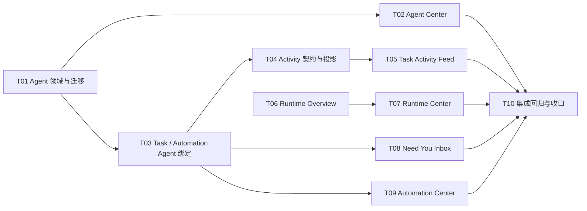

# Product Phase 2 任务总览

> 状态：✅ T01–T10 已完成并通过用户最终验收  
> 上位文档：[Phase2_产品开发文档.md](../Phase2_产品开发文档.md)  
> 验收日期：2026-07-24；进入下一阶段仍需单独规划

## 1. 任务图

## 2. 任务清单

| ID | 任务 | 状态 | 优先级 | 依赖 | 验收产物 |
|---|---|---|---:|---|---|
| T01 | [Agent 领域模型与数据库迁移](T01_Agent领域模型与数据库迁移.md) | 工程完成 | P0 | 无 | v9/v10 迁移、Agent RPC、单测 |
| T02 | [Agent Center 页面](T02_Agent_Center页面.md) | 工程完成 | P0 | T01 | Agent 管理页面、E2E、视觉证据 |
| T03 | [Task 与 Automation 的 Agent 绑定](T03_Task与Automation的Agent绑定.md) | 工程完成 | P0 | T01 | Agent 快照、执行注入、冒烟 |
| T04 | [Activity 数据契约与投影](T04_Activity数据契约与投影.md) | 工程完成 | P0 | T03 | actor 迁移、ActivityView、映射单测 |
| T05 | [Task Activity Feed](T05_Task_Activity_Feed.md) | 工程完成 | P0 | T04 | 任务时间线、跳转、E2E |
| T06 | [Runtime Overview 服务](T06_Runtime_Overview服务.md) | 工程完成 | P0 | 无 | 运行时聚合 RPC、状态纯函数 |
| T07 | [Runtime Center 页面](T07_Runtime_Center页面.md) | 工程完成 | P0 | T06 | Runtime 页面、健康指示、E2E |
| T08 | [Need You Inbox](T08_Need_You_Inbox.md) | 工程完成 | P0 | T03 | 待办投影、直接处理、E2E |
| T09 | [Automation Center](T09_Automation_Center.md) | 工程完成 | P1 | T03 | 自动化页、历史、立即运行、冒烟 |
| T10 | [集成回归与阶段收口](T10_集成回归与阶段收口.md) | ✅ 完成并验收通过 | P0 | T02/T05/T07/T08/T09 | 全量回归、升级实弹、文档审计 |

## 3. 推荐执行顺序

按以下顺序提交，避免共享文件冲突：

1. T01；
2. T02；
3. T03；
4. T04；
5. T05；
6. T06；
7. T07；
8. T08；
9. T09；
10. T10。

T06 在工程上可与 T02–T05 并行，但如果仍采用单执行者模式，按上面顺序即可。

## 4. 每个任务的统一 Definition of Done

任务只有同时满足以下条件才可标记完成：

1. 任务文档中的范围全部实现，没有偷偷扩大；
2. 先有失败测试或明确的旧行为证据；
3. 修改后的相关测试通过；
4. `npm run typecheck` 通过；
5. `npm test` 通过；
6. `npm run build` 通过；
7. 相关 Electron E2E 通过；
8. 相关冒烟通过；
9. 新 UI 有稳定帧截图、900×600 检查和无 console/page error 证据；
10. `docs/审计与交接.md` 追加实测记录；
11. commit 使用仓库 Lore Commit Protocol；
12. 明确列出未测边界。

## 5. 全阶段禁止事项

- 不引入聊天、评论、@mention、Squad；
- 不接云端服务或遥测；
- 不复制 Multica 源码、组件、品牌或素材；
- 不新建 Issue 表或第二套任务状态机；
- 不新增 Activity、Inbox、Schedule History 的事实表；
- 不让 Renderer 拼接模型 Prompt；
- 不允许 Agent 绕过全局风险控制；
- 不用拖拽直接改变任务状态；
- 未经用户单独确认不新增 npm 依赖。

## 6. 验收批次

用户可按四批验收：

- **批次 A：Agent 身份**：T01–T03；
- **批次 B：过程可解释**：T04–T05；
- **批次 C：运行与行动**：T06–T08；
- **批次 D：自动化与阶段关闭**：T09–T10。

任一批次验收不通过，停止后续批次，先修正文档或实现。
